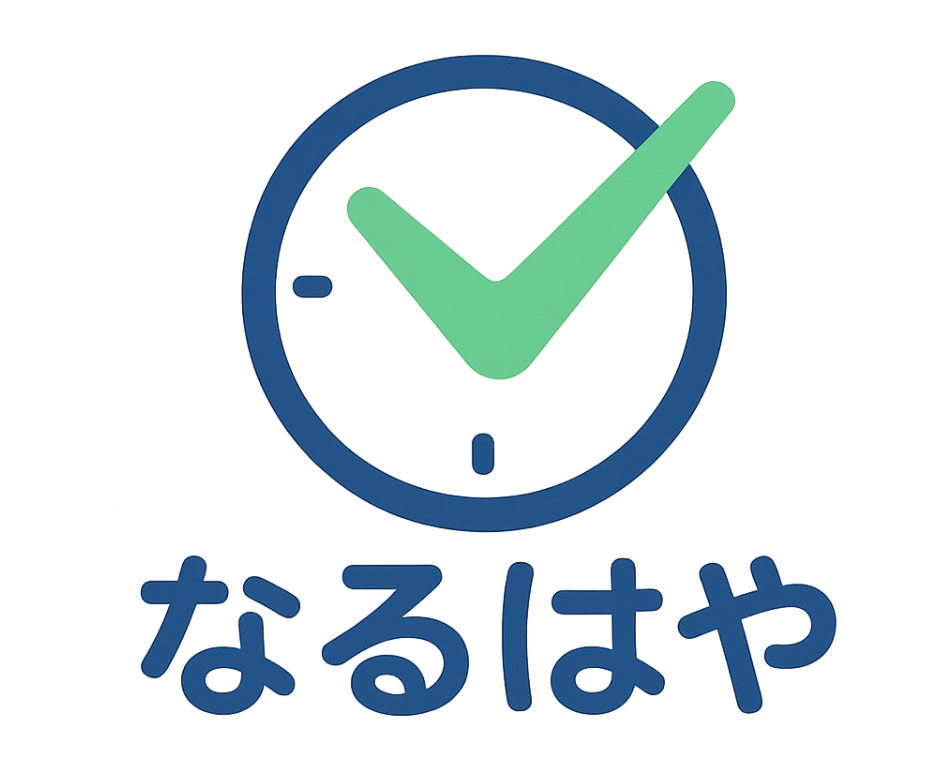

# なるはや

  <picture>
    <source media="(prefers-color-scheme: dark)" srcset="assets/logo-naruhaya-dark.png">
    
  </picture>

## 製品概要
### 背景(製品開発のきっかけ、課題等）
やるべきタスクがあるのに、なかなか手をつけられない、いつも期限ギリギリになってしまう、もっと時間があれば内容を改善できたのに、こんな悩みありませんか？私たちのチームではタスクを予定通りにこなす習慣をつけたい、また予定通りこなして生活にゆとりを持ちたい！という発想の本アプリ「なるはや」の開発を行いました。
### 製品説明（具体的な製品の説明）
「Leeway」は本来の予定を意識させないことで予定の期限をランダムに早める実際のタスクを意識させず終わらせるような仕組みとなっています。
### 特長
#### 1. 特長1
本来の期限を意識させない仕組みづくり
#### 2. 特長2
通知による早めたタスクの期限の意識づくり
#### 3. 特長3
１週間に集中的にタスクをスケジューリングするイベントの発生し、タスクを消費させる習慣づくりの仕組み

### 解決出来ること
ギリギリにならないと動けない人がタスクを余裕を持ってこなす習慣を作ることができる
### 今後の展望
さらなる予定スケジューリングの仕組みづくり、集中タスクを作るイベントのアニメーションの作成
### 注力したこと（こだわり等）
* どのようにタスクの期限を意識させないか、偽のタスクの締め切りを信じさせるか（ランダムにするなどの仕組みづくり）
* モチベーションを産むためのアニメーション

## 開発技術
### 活用した技術
#### API・データ
* Google Calender
* Firebase

#### フレームワーク・ライブラリ・モジュール
* Flutter
* Android Studio

#### デバイス
* Xiaomi Readmi 12 5G

### 独自技術
#### ハッカソンで開発した独自機能・技術
* 実際の予定を意識させずタスクを早く計画的に終わらせるようにするための仕組みづくり（ランダムにタスクの締め切りを変える・通知）
* 集中的にタスクをこなすイベントとそのアニメーション追加
>>>>>>> bdce91e3238ab0d4aa13ed3d0f0fc51af437debb
